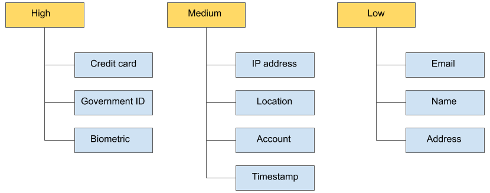

<a name="readme-top"></a>

# Bigquery Policy Tags

This Terraform module creates new Taxonomy policy tags in BigQuery, column level security and dynamic masking. Build a hierarchy of data classes that makes sense for your use-case.

To enhance column-level access control, you can optionally use dynamic data masking. Data masking lets you mask sensitive data by substituting null, default, or hashed content in place of the column's actual value.

To restrict data access at the column level: 
- Define a taxonomy and policy tags. Create and manage a taxonomy and policy tags for your data. For guidelines, see Best practices for policy tags.

- Assign policy tags to your BigQuery columns. In BigQuery, use schema annotations to assign a policy tag to each column where you want to restrict access.

- Enforce access control on the taxonomy. Enforcing access control causes the access restrictions defined for all of the policy tags in the taxonomy to be applied.

- Manage access on the policy tags. Use Identity and Access Management (IAM) policies to restrict access to each policy tag. The policy is in effect for each column that belongs to the policy tag.

When a user tries to access column data at query time, BigQuery checks the column policy tag and its policy to see whether the user is authorized to access the data.




- [Bigquery Policy Tags](#bigquery-policy-tags)
  - [Folder Structure](#folder-structure)
  - [Prerequisites](#prerequisites)
    - [APIs to Enable](#apis-to-enable)
    - [IAM Permissions](#iam-permissions)
  - [Usage](#usage)
    - [YAML Configuration](#yaml-configuration)
    - [Taxonomy and policy tags creation](#taxonomy-and-policy-tags-creation)
      - [GCP Quota Limitation](#gcp-quota-limitation)
      - [Considerations](#considerations)
    - [Column level security](#column-level-security)
    - [Dynamic data masking](#dynamic-data-masking)
  - [Useful Links](#useful-links)

## Folder Structure

| File      | Description |
| :---        |    :----   |
| __/config/config_example.yaml__ | YAML configuration file to create taxonomies and policy tags|
| __main.tf__ | The infrastructure code. As this file grows, consider breaking it up into smaller, well-named files |
| __output.tf__ | The outputs of the module |
| __providers.tf__ | Contains the `provider {}` blocks indicating the version of each provider needed|
| __README.md__ | This file|
| __variables.tf__ | All the variables for the module|


## Prerequisites

- Terraform Installed
- Google Cloud SDK installed

### APIs to Enable

- [Data Catalog API: datacatalog.googleapis.com](https://console.cloud.google.com/apis/library/datacatalog.googleapis.com)
- [BigQuery API: bigquery.googleapis.com](https://console.cloud.google.com/apis/library/bigquery.googleapis.com)
- [BigQuery Data Policy API: bigquerydatapolicy.googleapis.com](https://console.cloud.google.com/apis/library/bigquerydatapolicy.googleapis.com)

### IAM Permissions

* roles/datacatalog.admin: To members who create and manage taxonomy and policy tags.
* roles/bigquery.admin: BigQuery Admin or BigQuery Data Owner: to enforce access control for column-level control, i.e. create and manage data policies.
- Further details on roles can be found [here](https://cloud.google.com/bigquery/docs/column-level-security-intro#roles).

## Usage

### YAML Configuration

YAML Ain't Markup Language (YAML) is a data serialization language that is consistently listed as one of the most popular programming languages. YAML file is used as a configuration file to create multiple taxonomies as well as column security and data masking policies. A sample YAML file can be found in this module to get started (Refer to __config_example.yaml__ in the config folder).

There are three main sections that users can define in the YAML configuration file:

- __taxonomy__ creates a taxonomy resource, which holds the collection of policy tags.
- __security__ contains security configurations such as column level security and data masking rules.
- __iam_roles__ contains user access controls.

The structure of the YAML file is as follows:

```yaml
project_id: GCP_PROJECT_ID
region: PROJECT_REGION
taxonomy:
  - id: TAXONOMY_ID
    description: description_of_the_taxonomy
    activated_policy_types: ["FINE_GRAINED_ACCESS_CONTROL"] # https://cloud.google.com/data-catalog/docs/reference/rpc/google.cloud.datacatalog.v1beta1#google.cloud.datacatalog.v1beta1.Taxonomy.PolicyType
    policy_tags:
      - id: parent_policy
        description: description_of_the_above_policy_tag
        level_one:
          - id: child_policy
            description: description_of_the_above_policy
            level_two:
              - id: child_Two
                description: description_of_the_child_2_policy
              - id: yet_another_child_2_policy
                description: description_of_the_policy

security:
  column_lvl_sec:
    - data_policy_id: column_security_ID
      policy_tag: name
  masking:
    - data_policy_id: DATA_POLICY_ID
      policy_tag: name
      predefined_expression: ALWAYS_NULL

iam_roles:
  finegrained_reader_access:
    - name_of_the_policy: POLICY_ID
      members:
        - user:ID1
        - user:ID2
  masked_reader_policy:
    - name_of_the_policy: POLICY_ID2
      members:
        - user:ID3
```

### Taxonomy and policy tags creation

A taxonomy consists of one or multiple policy tags. For best practices of using policy tags, please refer to this [documentation](https://cloud.google.com/bigquery/docs/best-practices-policy-tags).

__Description of the variables__ in the `taxonomy` section:

| Key      | Description |
| :---        |    :----   |
|__taxonomy__|
| id| Required - Unique name for the taxonomy |
| description | Optional - Brief description of the taxonomy. It must contain only unicode characters, tabs, newlines, carriage returns and page breaks and be at most 2000 bytes. |
| activated_policy_types | Optional, the value is either `FINE_GRAINED_ACCESS_CONTROL` or `POLICY_TYPE_UNSPECIFIED`
| __policy_tags__ |
| id | Required - Unique name of the parent policy tag |
| description | Optional - Brief description of the policy tag. It must contain only unicode characters, tabs, newlines, carriage returns and page breaks and be at most 2000 bytes.  |
| __level_one__ (Optional)** |
| id | Required - Unique name of the level 1 child policy tag |
| description | Optional - Brief description of the level 1 child policy tag. It must contain only unicode characters, tabs, newlines, carriage returns and page breaks and be at most 2000 bytes. |
| __level_two__  (Optional)** |
| id | Required - Unique name of the level 2 child policy tag |
| description | Optional - Brief description of the level 2 child policy tag. It must contain only unicode characters, tabs, newlines, carriage returns and page breaks and be at most 2000 bytes. |
| __level_three__ (Optional) |
| id | Required - Unique name of the level 3 child policy tag |
| description | Optional - Brief description of the level 3 child policy tag. It must contain only unicode characters, tabs, newlines, carriage returns and page breaks and be at most 2000 bytes. |
| __level_four__ (Optional) |
| id | Required - Unique name of the level 4 child policy tag |
| description | Optional - Brief description of the level 4 child policy tag. It must contain only unicode characters, tabs, newlines, carriage returns and page breaks and be at most 2000 bytes. |

__Example YAML__:

The following taxonomy _data_classification_project_1_ has 5 layers of policy tags (1 parent policy tags and 4 child policy tags). You can have __40__ number of taxonomies per project with __5 level layers__ of policies tags (Refer to __GCP Quota Limitations__ section below):

```yaml
project_id: GCP_PROJECT_ID
region: europe-west2
taxonomy:
  - id: data_classification_project_1
    description: Information governance to describe the process of identifying, categorizing, and protecting content according to its sensitivity or impact level.
    activated_policy_types: ["FINE_GRAINED_ACCESS_CONTROL"]
    policy_tags:
      - id: high_level_sensitivity
        description: Highly sensitive personal information might be present
        level_one:
          - id: pii
            description: Personally Identifiable Information
            level_two:
              - id: name
                description: name
                level_three:
                  - id: passport_number
                    description: passport number
                    level_four:
                      - id: nationality
                        description: nationality
                      - id: DOB
                        description: Date of Birth
```

#### GCP Quota Limitation

- Maximum depth of the policy tags tree (100 policy tags per taxonomy still applies): __5__
- Maximum number of policy tags per taxonomy: __100__
- Maximum number of taxonomies per project: __40__
- Length of a policy tag name: __200 bytes__
- Description of taxonomy/policy tags: __2000 bytes__

#### Considerations

- To apply policy tags from a taxonomy to a table column, the taxonomy and the table must exist in the __same regional location__. If the taxonomy exists in a different location, you can copy the taxonomy to another location by explicitly replicating it there.
- A table and any policy tags that you want to apply to its columns must exist within the same organization.

### Column level security

To restrict access to columns of the table, specify the policy tag used for the restricted column in the `security` section as follows:

| Key      | Description |
| :---        |    :----   |
|__column_lvl_sec__ (Optional)|
| data_policy_id|  Unique name for the data policy |
| policy_tag |  Name of the policy tag |

__Example YAML:__

```yaml
security:
  column_lvl_sec:
    - data_policy_id: column_sec_policy
      policy_tag: name
```

The Data Catalog Fine-Grained Reader role is required for users who need access to data in secured columns. To give the Fine-Grained Reader role to users the following needs to be added in the `iam_role`, `finegrained_reader_access` section as follows:

```yaml
iam_roles:
  finegrained_reader_access:
    - name_of_the_policy: pii
      members:
      - user:EMAIL_ID@email.com
      - user:EMAIL_ID2@email.com
```

### Dynamic data masking

BigQuery supports [dynamic data masking](https://cloud.google.com/bigquery/docs/column-data-masking-intro) at the column level. You can use data masking to selectively mask column data for groups of users, while still allowing access to the column.

Specify the masking rule used for polity tag in the `security`, `predefined_expression` as follows:

| Key      | Description |
| :---        |    :----   |
|__masking__ (Optional)|
| data_policy_id| Unique name for the data policy |
| policy_tag | Name of the policy tag   |
| predefined_expression | Masking rules |

There are seven masking rules. For each policy tag multiple masking rules can be applied with different access members. A member who has masked reader role for both masking rule, the masking rule that is higher in the hierarchy will be applied. For instance, user A has access to the policy tag called `email_address` with two masking rules applied hashing and email mask. Hashing will be applied for user A to view in this case.

The list below shows the masking rules and the hierarchy. Full details of each masking rule can be found [here](https://cloud.google.com/bigquery/docs/column-data-masking-intro#masking_options).

Specify one of the following in `predefined_expression`.

1. Hash: `SHA256`
2. Email mask: `EMAIL_MASK`
3. Last four characters: `LAST_FOUR_CHARACTERS`
4. First four characters: `FIRST_FOUR_CHARACTERS`
5. Date year mask: `DATE_YEAR_MASK`
6. Default masking value: `DEFAULT_MASKING_VALUE`
7. Nullify: `ALWAYS_NULL`

__Example YAML__

```yaml
security:
  masking:
    - data_policy_id: mask_pii
      policy_tag: email_address
      predefined_expression: SHA256
```

The Masked Reader role is required for users who need access to query the masked columns. To give Masked Reader role to users the following needs to be added in the `iam_role`, `masked_reaeder_policy` section as follows:

```yaml
iam_roles:
  masked_reader_policy:
    - name_of_the_policy: email_address
      members:
        - user:first.last@email.com
```

For more information about role interaction, refer to [How Masked Reader and Fine-Grained Reader roles interact](https://cloud.google.com/bigquery/docs/column-data-masking-intro#role-interaction).

## Useful Links
- [Terraform BiqQuery Data Policty](https://registry.terraform.io/providers/hashicorp/google/latest/docs/resources/bigquery_datapolicy_data_policy)
- [Terraform Data Catalog Taxonomy](https://registry.terraform.io/providers/hashicorp/google/latest/docs/resources/data_catalog_taxonomy)


<p align="right">(<a href="#readme-top">back to top</a>)</p>
